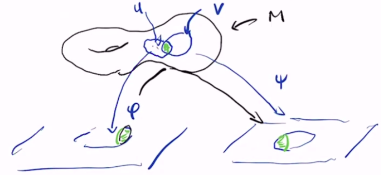
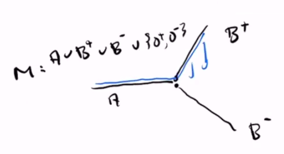
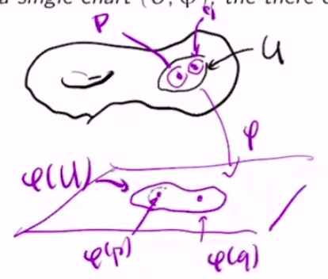

# Introduction

$$
\newcommand{\ds}{\displaystyle}
\newcommand{\curlies}[1]{\left\lbrace #1 \right\rbrace}
\newcommand{\abs}[1]{\left\lvert #1 \right\rvert}
\newcommand{\angles}[1]{\left\langle #1 \right\rangle}
\newcommand{\inv}[1]{#1^{-1}}

\newcommand{\A}{\mathcal A}
\newcommand{\RP}[1]{\R P^{#1}}

\newcommand{\x}{\mathbf x}
\newcommand{\y}{\mathbf y}
$$

## Intro to manifolds

The extrinsic perspective of an $n$-dimensional manifold is a subset of $\R^N$, usually as the level set of a function $\R^N \to \R^k$ where $n = N - k$. However, we will not adopt this perspective.

We will use the intrinsic definition, that an $n$-dimensional manifold is something that locally looks like $\R^n$.

The advantages of this are that:

- often there is no natural, unique, or canonical embedding of a manifold in $\R^N$
  - e.g. non-orientable surfaces cannot be embedded in $\R^3$
- extrinsic descriptions may be unnecessarily complicated
- a particular realization of a manifold as a subset of $\R^N$ is often irrelevant to questions that geometers ask

Some examples of manifolds are:

- The unit sphere in $\R^3$, i.e. the 2-sphere
- The set of all orthonormal bases of $\R^3$, which is homeomorphic to $SO(3)$
- the linkage of $N$ rods into a loop (this is only interesting for $N \geq 4$)
- the real projective plane $\RP2$, the set of all 1-dimensional subspaces (lines through the origin) in $\R^3$
  - $\RP2 = \curlies{x \in \R^3 : \abs x = 1}/\sim$ where $x \sim -x$

## Coordinate charts

### Coordinate charts

Let $M$ be a set. An **$m$-dimensional coordinate chart** $(U, \phi)$ is a subset $U \subseteq M$ and an injective map $\phi : U \to \R^m$ such that $\phi(U)$ is open. $U$ is called the **chart domain** and $\phi$ is called the **coordinate map**.

Two charts $(U, \phi)$ and $(V, \psi)$ are **compatible** if:

- $\phi(U \cap V)$ and $\psi(U \cap V)$ are open
- $\psi \circ \inv \phi : \phi(U \cap V) \to \psi(U \cap V)$ is a diffeomorphism

$\psi \circ \inv \phi$ is called a **transition map** or **change of coordinates**.

Compatibility of coordinate charts is not an equivalence relation, because it is not transitive.

### Atlases

Let $M$ be a set. An **$m$-dimensional atlas on $M$** is a collection of coordinate charts $\A = \curlies{(U_\alpha, \phi_\alpha)}_{\alpha \in A}$ such that:

- $\ds M = \bigcup_{\alpha \in A} U_\alpha$
- for all $\alpha, \beta \in A$, $(U_\alpha, \phi_\alpha)$ and $(U_\beta, \phi_\beta)$ are compatible

A coordinate chart $(U, \phi)$ is **compatible** with an atlas $\A$ if it is compatible with every chart in $\A$. Equivalently, $(U, \phi)$ is compatible with $\A$ if $A \cup \curlies{(U, \phi)}$ is still an atlas.

### Compatible charts and atlases

Let $\A$ be an atlas on $M$, and let $(U, \phi)$ and $(V, \psi)$ be two charts on $M$. If $(U, \phi)$ and $(V, \psi)$ are both compatible with $\A$, then they are compatible with each other.

Consider $U \cap V$. Since they are coordinate charts on $M$ and the union of the domains of charts in $\A$ is $M$, we know that

$$
U \cap V = \bigcup_{\alpha \in A} U \cap V \cap U_\alpha = \bigcup_{\alpha \in A} (U \cap U_\alpha) \cap (V \cap U_\alpha)
$$

Since $U$ is compatible with every chart in $\A$, $U \cap U_\alpha$ is always open, and the same holds for $V$. Thus, $(U \cap U_\alpha) \cap (V \cap U_\alpha)$ is an open set for every $\alpha$, so each of these is open. An arbitrary union of open sets is open, so $U \cap V$ is open.

### Maximal atlases

An atlas on $M$ is **maximal** if it is not a proper subset of a larger atlas, i.e. every chart that is compatible with $\A$ is already in $\A$.

Let $\A$ be an atlas on $M$, and let $\overline \A$ be the collection of all charts that are compatible with $\A$. Then $\overline \A$ is the unique maximal atlas containing $\A$.

## Manifolds

### First attempt at a definition

The following definition does not work:

An $m$-dimensional manifold is a set $M$ with a maximal $m$-dimensional atlas.

*This definition has issues!*

For example, with this definition, we can define some problematic "manifolds":

- Let $M = \R$ and $\A = \curlies{(\curlies{\alpha}, \phi) : \alpha \in \R, \phi(x) = 0}$, so every $U_\alpha = \curlies \alpha$ and every $\phi_\alpha (x) = 0$. $\A$ is a maximal $0$-dimensional atlas, so this fits our definition.
  - We have shown $\R$ to be a 0-dimensional manifold. But this is not what we want - we'd like to think of $\R^1$ as a 1-dimensional manifold.
- Let $A = (-\infty, 0) \times \curlies 0$, $B^+ = \curlies{(t, t) : t > 0}$, and $B^- = \curlies{(t, -t) : t > 0}$, each is a subset of $\R^2$. Let $M = A \cup B^+ \cup B^-$. For our atlas, we can define [...]
  - 
  - we do not want this to be a manifold

### Definition of a manifold

An $m$-dimensional **manifold** is a set $M$ together with a maximal $m$-dimensional atlas $\A = \curlies{(U_\alpha, \phi_\alpha)}_{\alpha \in A}$ where:

- there are indices $\alpha_1, \alpha_2, ...$ so that $\ds M = \bigcup_{i = 1}^\infty U_{\alpha_i}$ (countability)
- for any $p, q \in M$ where $p \neq q$, there are coordinate patches $U_\alpha$ and $U_\beta$ so that $p \in U_\alpha$, $q \in U_\beta$, and $U_\alpha \cap U_\beta = \emptyset$ (Hausdorff)

### Hausdorff lemma

Let $M$ be a set with a maximal atlas $\A$. If $p, q \in M$ are points that are both in the domain $U$ of a single chart $(U, \phi) \in \A$, then the Hausdorff condition holds, i.e. there are disjoint coordinate patches $U_\alpha, U_\beta$ so that $p \in U_\alpha$ and $q \in U_\beta$.

$\phi : U \to \R^m$ is injective, so $\phi(p) \neq \phi(q)$. Since $\R^m$ is Hausdorff, we can choose disjoint open sets $P, Q$ so that $\phi(p) \in P$ and $\phi(q) \in Q$. Let $U_\alpha = \inv\phi(P)$ and $U_\beta = \inv\phi(Q)$.

### Examples of manifolds

- the $n$-sphere $S^n \subseteq \R^{n+1}$
- the real projective plane $\RP n = (\R^3 \setminus \curlies{0})/\sim$ where $\x \sim \y$ when there exists $\lambda \neq 0$ so that $\x = \lambda \y$
  - note that $\RP n = \R^n \sqcup \R^{n-1} \sqcup ... \sqcup \R^1 \sqcup \R^0$
- the real Grassmanian $Gr(k, n)$, the set of all $k$-dimensional subspaces of $\R^n$, is a manifold of dimension $n-k$
  - $Gr(1, n) = \RP {n-1}$

