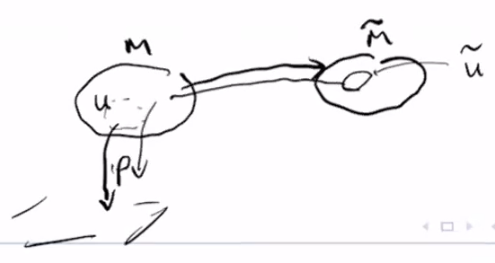

# Smooth and Continuous Functions

$$
\newcommand{\ds}{\displaystyle}
\newcommand{\curlies}[1]{\left\lbrace #1 \right\rbrace}
\newcommand{\abs}[1]{\left\lvert #1 \right\rvert}
\newcommand{\angles}[1]{\left\langle #1 \right\rangle}
\newcommand{\inv}[1]{#1^{-1}}
\DeclareMathOperator{\supp}{supp}
\DeclareMathOperator{\id}{id}

\newcommand{\A}{\mathcal A}
\newcommand{\RP}[1]{\R P^{#1}}
\newcommand{\CP}[1]{\C P^{#1}}

\newcommand{\x}{\mathbf x}
\newcommand{\y}{\mathbf y}
$$

## Smooth functions on manifolds

Let $M$ be a set with a maximal connected atlas, and let $f: M \to \R$ be a function.

$f$ is **smooth at $p \in M$** if there exists a chart $(U, \phi)$ such that $p \in U$ and

$$
f \circ \inv\phi : \phi(U) \to \R
$$

is smooth at $\phi(p)$ as a function from $\R^m \to \R$. We say that $f$ is **smooth** if it is smooth at every $p \in M$. The set of all smooth functions on $M$ is $C^\infty(M)$.

Note that if $f \circ \inv\phi$ is smooth at $\phi(p)$, then $f \circ \inv\psi$ is smooth at $\psi(p)$ for every chart $(V, \psi)$ that is compatble with $(U, \phi)$ with $p \in V$.

### $C^\infty(M)$ is an algebra

An **algebra** is a vector space with a vector product and an identity.

Considering $C^\infty(M)$,

- if $f, g \in C^\infty(M)$ and $a, b \in R$, then $af + bg \in C^\infty(M)$
- if $f, g \in C^\infty(M)$ then $fg \in C^\infty(M)$
- $1 \in C^\infty(M)$

### Smooth functions are continuous

Suppose $f: M \to \R$ is smooth, then for all charts $(U, \phi)$, $f \circ \inv\phi$ is smooth. Smooth functions from $\R^m$ to $\R$ are continuous, so $f \circ \inv\phi$ is continuous. This means that for all open $V \subseteq \R$, we know that $S = (f \circ \inv\phi)^{-1}(V)$ is open. Then $S = \phi(U \cap \inv f(V))$, so $U \cap \inv f(V)$ is open in $M$ for every $U$. This means that

$$
\bigcup_{\alpha} U_\alpha \cap \inv f(V) = \inv f(V)
$$

is open. Thus, $f$ is continuous.

### Support

If $f: M \to \R$ is a function, then the **support** of $f$ is

$$
\supp(f) = \text{closure of } \curlies{x \in M : f(x) \neq 0}
$$

### Extension by zero

Let $M$ be a manifold, $U \subseteq M$ be an open subset, and $g \in C^\infty(U)$ be a function so that $\supp(g) \subseteq U$ is closed in $M$. The **extension by zero** of $g$ is the function:
$$
\begin{align*}
\widetilde g: M &\to \R \\
x &\mapsto \begin{cases}
g(x) & x \in U \\
0 & x \notin U
\end{cases}
\end{align*}
$$

The extension by zero of $g$ is smooth:

### Hausdorff manifolds have separating smooth functions

Let $M$ be a set with an $m$-dimensional maximal atlas, then $M$ is Hausdorff if and only if for all distinct $p, q \in M$, there exists a smooth function $f \in C^\infty(M)$ such that $f(p) \neq f(q)$.

($\Leftarrow$) Suppose there is a smooth function $f \in C^\infty(M)$ where $f(p) \neq f(q)$. $\R$ is Hausdorff, so we can find disjoint open neighbourhoods $W_p$ and $W_q$ of $f(p)$ and $f(q)$. $f$ is continuous, so $\inv f(W_p)$ and $\inv f(W_q)$ are open and disjoint neighbourhoods of $p$ and $q$.

($\Rightarrow$) Suppose $M$ is Hausdorff, then for all $p \neq q$, there are disjoint open neighbourhoods of $p$ and $q$. Let $U, V$ be disjoint open neighbourhoods of $p, q$.

This theorem implies that $M$ is Hausdorff if there exists a smooth injective function $F: M \to \R^K$ for some $K$.

### $\R P^n$ is Hausdorff

We will show this by defining a smooth function $F: \RP{n} \to \R^K$ for $K = (n+1)^2$.

Let $\x$ denote $(x^0, ..., x^n)$. Then we define

$$
\begin{align*}
F: \RP{n} &\to \R^{(n + 1) \times (n + 1)}\\
(x^0 : ... : x^n) &\mapsto \frac{\x \x^T}{\abs{\x}^2}
\end{align*}
$$

This is well defined on $\RP{n}$, because

$$
\frac{\lambda \x \lambda \x^T}{\abs{\lambda \x}^2} = \frac{\lambda^2 \x \x^T}{\lambda^2 \abs{\x}^2} = \frac{\x \x^T}{\abs{\x}^2}
$$

so it does not depend on the choice of $\x$ for any equivalence class $(x^0 : ... : x^n)$ in $\RP{n}$.

## Smooth functions between manifolds

Let $M, N$ be manifolds, and $F: M \to N$ be a function. $F$ is smooth at $p \in M$ if there exist charts $(U, \phi)$ around $p$ and $(V, \psi)$ around $F(p)$ so that $F(U) \subseteq V$, and $\phi \circ F \circ \inv\phi : \phi(U) \to \psi(V)$ is smooth at $\phi(p)$. If $F$ is smooth at every $p \in M$, then $F$ is a smooth function from $M$ to $N$, and we write $F \in C^\infty(M, N)$.

- if a function is smooth with respect to an atlas $\A$, then it is smooth with respect to the maximal atlas generated by $\A$
- smooth maps from $M$ to $N$ are continuous

### Compositions of smooth functions are smooth

Let $M_1, M_2, M_3$ be manifolds, and $F_1 \in C^\infty(M_1, M_2)$ and $F_2 \in C^\infty(M_2, M_3)$ be smooth functions, then $F_2 \circ F_1$ is a smooth function in $C^\infty(M_1, M_3)$.

### Examples of smooth maps

The inclusion map $i : S^n \to \R^{n+1}$ is smooth.

If $F \in C^\infty(\R^{n+1}, N)$, then the restriction of $F$ to the sphere $F\vert_{S^n}: S^n \to N$ is smooth, because $F_{S^n} = F \circ i$.

The natural projections to projective spaces are smooth, including

$$
\begin{align*}
\pi_1: \R^{n+1} \setminus \curlies 0 &\to \RP{n} \\
(x^0, ..., x^n) &\mapsto (x^0 : ... : x^n)
\end{align*}
$$

and

$$
\begin{align*}
\pi_2: \C^{n+1} \setminus \curlies 0 &\to \CP{n} \\
(z^0, ..., z^n) &\mapsto (z^0 : ... : z^n)
\end{align*}
$$
So the natural projections from $S^n$ to $\RP{n}$ defined by identifying antipodal points are also smooth, as they are just compositions $\pi_1 \circ i$. This works similarly for projections from $S^{2n+1}$ to $\CP{n}$.

### Lifts

For any function $F: \RP{n} \to N$, we can define by
$$
\begin{align*}
\widetilde F: \R^{n+1} \setminus \curlies 0 &\to N \\
\x &\mapsto F \circ \pi(\x)
\end{align*}
$$
It is also clear that every function that is homogeneous of degree 0 is the lift of a function on $\RP{n}$.

Thus we have a correspondence between functions on $\RP{n}$ and functions on $\R^{n+1}$ that are homogeneous of degree 0.

Furthermore, $F$ is smooth if and only if $\widetilde F$ is smooth.

### Diffeomorphisms between manifolds

Let $M$, $N$ be manifolds. $F: M \to N$ is a **diffeomorphism** if it is smooth and invertible and if $\inv F$ is smooth.

$M$ and $N$ are **diffeomorphic** if there exists a diffeomorphism between them. This is an equivalence relation:

- $M$ is diffeomorphic to itself by the identity function
- if $F$ is a diffeomorphism from $M$ to $N$, then $\inv F$ is a diffeomorphism from $N$ to $M$
- if $A$ is diffeomorphic to $B$ and $B$ is diffeomorphic to $C$, then $A$ is diffeomorphic to $C$, as we can compose diffeomorphisms $A \to B$ and $B \to C$

We consider two diffeomorphic manifolds to be the same manifold.

### The relabelling diffeomorphism

Suppose $M$ is a manifold with atlas $\A = \curlies{(U_\alpha, \phi_\alpha)}$. Let $\widetilde M$ be any set with the same cardinality as $M$, so we can choose a bijection $F: M \to \widetilde M$. Define $\widetilde A = \curlies{(\widetilde U_\alpha, \widetilde \phi_\alpha)}$, where $\widetilde U_\alpha = F(U_\alpha)$ and $\widetilde \phi_\alpha = \phi_\alpha \circ \inv F$.

Then $F$ is a diffeomorphism, because
$$
\widetilde \phi_\alpha \circ F \circ \inv\phi_\alpha = \phi_\alpha \circ \inv F \circ F \circ \inv\phi_\alpha = \id
$$
which is a diffeomorphism.

Essentially what we have done here is "relabelled" the points of $M$, by sending them to points of $\widetilde M$ using $F$.

#### Abstracting the set away

As a special case, given manifold $M$ with atlas $\A = \curlies{(U_\alpha, \phi_\alpha)}$, define $\widetilde M$ as follows:
$$
Q = \bigsqcup_\alpha \phi_\alpha(U_\alpha)
$$

For $x \in \phi_\alpha(U_\alpha), x' \in \phi_\beta(U_\beta)$, we say $x \sim x'$ if there is a $p \in M$ sot hat $x = \phi_\alpha(p)$ and $x' = \phi_\beta(p)$.

We define $\widetilde M = Q/\sim$, then $\widetilde M$ is diffeomorphic to $M$. This is a kind of formal way to "forget" about $M$, and define the manifold (almost) only in terms of the charts on it. The point is that formally, $M$ is not too important aside from keeping track of charts. However, in practice, keeping track of $M$ can make things nicer, e.g. using $S^n \subseteq \R^{n+1}$ with its natural topology.

### $\R P^1$ and $S^1$ are diffeomorphic

Recall some details about $\RP1$:

- $U_0 = \curlies{(x^0 : x^1) : x^0 \neq 0}$ and $U_1 = \curlies{(x^0 : x^1) : x^1 \neq 0}$
- $\ds \phi_0(x^0 : x^1) = \frac{x^1}{x^0}$ and $\ds \phi_1(x^0 : x^1) = \frac{x^0}{x^1}$
- $\phi_0(U_0) = \phi_1(U_1) = \R$
- $\phi_0(U_0 \cap U_1) = \phi_1(U_0 \cap U_1) = \R \setminus \curlies{0}$
- $\ds \phi_1 \circ \inv\phi_0(u) = \frac{1}{u}$

And about $S^1$:

- $U_+ = \curlies{(x^0, x^1) \in S : x^0 > -1}$ and $U_- = \curlies{(x^0, x^1) \in S : x^0 < 1}$
- $\ds \phi_+(x^0, x^1) = \frac{x^1}{1 + x^0}$ and $\ds \phi_-(x^0, x^1) = \frac{x^1}{1 - x^0}$
- $\phi_+(U_+) = \phi_-(U_-) = \R$
- $\phi_+(U_+ \cap U_-) = \phi_-(U_+ \cap U_-) = \R \setminus \curlies{0}$
- $\ds \phi_- \circ \inv\phi_+(u) = \frac{1}{u}$

These two atlases show us that $\RP1$ and $S^1$ have similar structure.

Motivated by this, we can define a diffeomorphism between them that is equal to $\inv\phi_+ \circ \phi_0$ on $U_0 = \RP1 \setminus \curlies{(0 : 1)}$. Luckily, the formula for the resulting function maps the remaining point $(0 : 1) \in \RP1$ to the remaining point $(1, 0) \in S^1$ in a smooth way, so we have found a diffeomorphism.
$$
\begin{align*}
F: \RP1 &\to S^1 \\
(x^0 : x^1) &\mapsto \frac{1}{\abs \x}((x^1)^2 - (x^0)^2, 2x^0x^1)
\end{align*}
$$

### $\C P^1$ and $S^2$ are diffeomorphic

This can be done in a similar way to above - find the coordinate charts that expose similar structure, compose them, and check that the formula extends nicely to the rest of the manifold. The result even has a similar formula:
$$
F(z^0 : z^1) = \frac{1}{\abs{\mathbf z}^2}((z^1)^2 - (z^0)^2, 2z^0z^1)
$$

## Hopf Fibration

Consider the projection map $\pi: S^{2n+1} \to \CP{n}$ (identifying $S^{2n+1}$ with its embedding within $\C^{n+1}$). Writing $z$ for a point in $S^{2n+1}$ and $[z] = \pi(z)$ for a point in $\CP{n}$, consider the preimage $\inv\pi\curlies{[z]}$.
$$
\begin{align*}
[z] &= \pi(z) \\
&= \pi(z^0, ..., z^n) \\
&= \pi(\lambda z^0, ..., \lambda z^n) \text{ for any $\lambda \in \C$, $\abs \lambda = 1$} \\
&= \pi(\lambda z^0, ..., \lambda z^n) \text{ for any $\lambda \in S^1 \subseteq \C$}
\end{align*}
$$
(we require $\abs \lambda = 1$ because we are working with points in $S^{2n+1}$, not all of $\C^{n+1}$)

So every point in the preimage is $\lambda z$ for some $\lambda \in S^1$, so we can think of this preimage as a copy of $S^1$, i.e. a circle.

Since no point $z \in S^{2n+1}$ is in the preimage of more than one $[z] \in \CP{n}$, these circles are all disjoint, so we have partitioned $S^{2n+1}$ into circles.

Now consider the special case, $n = 1$, i.e. consider $\pi: S^3 \to \CP1$. Then we see that $S^3$ is a disjoint union of circles, indexed by points in $\CP1 = S^2$. This correspondence between points of $S^2$ and circles of $S^3$ is the **Hopf fibration**.

Composing $\pi$ with the diffeomorphism $d$ between $\CP1$ and $S^2$, we have the map
$$
\tau(w, z) = d \circ \pi(w, z) = d(w : z) = (\abs{w}^2 - \abs{z}^2, 2z \overline w) \in \R \times \C
$$
Then we can calculate the Hopf fibration for a given point, for example the north pole $p = (1, 0) \in \R \times \C$ (or $(1, 0, 0) \in \R^3$).

$\tau(w, z) = (1, 0)$ iff $\abs w = 1, z = 0$, which defines a circle.

Similarly, $\tau(w, z) = (-1, 0)$ iff $w = 0, \abs z = 1$.

To see this in $\R^3$,

[...]