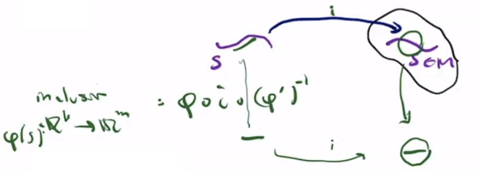
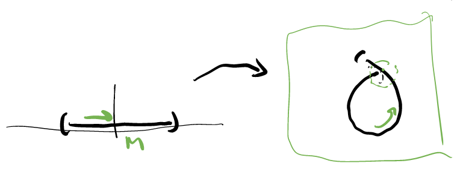

# Submanifolds

$$
\newcommand{\ds}{\displaystyle}
\newcommand{\curlies}[1]{\left\lbrace #1 \right\rbrace}
\newcommand{\abs}[1]{\left\lvert #1 \right\rvert}
\newcommand{\angles}[1]{\left\langle #1 \right\rangle}
\newcommand{\inv}[1]{#1^{-1}}
\DeclareMathOperator{\supp}{supp}
\DeclareMathOperator{\id}{id}
\DeclareMathOperator{\rank}{rank}
\DeclareMathOperator{\Mat}{Mat}

\newcommand{\A}{\mathcal A}
\newcommand{\RP}[1]{\R P^{#1}}
\newcommand{\CP}[1]{\C P^{#1}}

\newcommand{\x}{\mathbf x}
\newcommand{\y}{\mathbf y}
$$

## Submanifolds

Let $M$ be an $m$-dimensional manifold with Atlas $\A = \curlies{(U_\alpha, \phi_\alpha)}$.

A set $S \subseteq M$ is a **submanifold** of dimension $k \leq m$ if for every $p \in S$, there is a coordinate chart $(U, \phi)$ around $p$ so that

$$
\phi(U \cap S) = \phi(U) \cap \R^k
$$

(identifying $\R^k$ with $\R^k \times \curlies{0, ..., 0} = \R^k \times \curlies{0^{m-k}} \subseteq \R^m$

Note that a chart $(U, \phi)$ is trivially a submanifold chart if both sides of the equation above are empty.

### Submanifold charts

Let $S$ be a submanifold of $M$, and define the projection

$$
\pi: \R^m \to \R^k
$$

which projects points into the first $k$ coordinates.

Let

$$
\A' = \curlies{(U \cap S, \phi')}
$$

where $(U, \phi)$ is a submanifold chart and $\phi' = \pi \circ \phi$.

Then $\A'$ is an atlas for $S$ to make it a $k$-dimensional manifold, and the inclusion map $i: S \to M$ is smooth.

**Proof.**

First, we check that $S$ is a manifold with the given atlas. For any $(U \cap S, \phi')$, we know

$$
\begin{align*}
\phi'(U \cap S) &= \pi(\phi(U \cap S)) \\
&= \pi(\phi(U) \cap \R^k) \tag{which is open}
\end{align*}
$$

so $(U \cap S, \phi')$ is a chart.

Suppose $(U, \phi)$ and $(V, \psi)$ are submanifold charts for $S$, then we want to show that $(U \cap S, \phi')$ and $(V \cap S, \psi')$ are compatible. The transition map

$$
\psi' \circ \inv{(\phi')} : \phi'(U \cap V \cap S) \to \psi'(U \cap V \cap S)
$$

is smooth, as it is equal to the restriction of $\psi \circ \inv\phi$ to $\R^k$, which we know is smooth (and same with its inverse).

To check that $S$ is Hausdorff, we can simply use the fact that $M$ is Hausdorff to produce disjoint submanifold charts around any points $p, q \in S$.

Lastly we check that $S$ can be covered by a countable number of charts. Consider a countable atlas $\curlies{(U_\alpha, \phi_\alpha)}$ for $M$, and suppose $(U, \phi)$ is in this atlas. If we can show that $U \cap S$ is covered by a countable number of submanifold charts, then we know that $S$ can be covered by countably many.

[...]

Now to prove that the inclusion map is smooth, suppose $(U, \phi)$ is a submanifold chart for $S$ on $M$, and $(U \cap S, \phi')$ is the corresponding chart on $S$. Then $\phi \circ i \circ (\phi')^{-1}(x) = (x) \times \curlies{0^{m-k}}$, which is the inclusion map from $\R^k$ to $\R^m$, which is smooth. Thus, $i$ is smooth.

### Examples of submanifolds

- any open subset of an $m$-dimensional manifold $M$ is an $m$-dimensional submanifold
- $\R^k \subset \R^m$
- $S^k \subset S^m$
- $\RP{k} \subset \RP{n}$
- $\CP{k} \subset \CP{n}$

### Graphs

Suppose $M$ and $N$ are $m$ and $n$-dimensional manifolds with atlases $\curlies{(U_\alpha, \phi_\alpha)}$ and $\curlies{(V_\beta, \psi_\beta)}$, then $N \times M$ is the **product manifold** with atlas $\curlies{(V_\beta \times U_\alpha, \psi_\beta \times \phi_\alpha)}$.

If $F: M \to N$ is a smooth function, then

$$
\text{graph}(F) = \curlies{(F(p), p) : p \in M} \subseteq N \times M
$$

is an $m$-dimensional submanifold of $N \times M$.

**Proof.**

Suppose $(F(x), x) \in \text{graph}(F)$. Then let $(U, \phi)$ be a chart for $M$ around $x$ and $(V, \psi)$ be a chart for $N$ around $F(x)$. Let $W = V \times U$ and $\Phi : W \to \R^{m + n}$, where 

$$
\Phi(y, x) = (\phi(x), \psi(y) - \psi(F(x)))
$$

This is a chart for $N \times M$: if we define

$$
\begin{align*}
f(y, x) &= (\phi(x), \psi(y)) \\
g(x, y) &= (x, y - (\psi \circ F \circ \inv\phi)(x))
\end{align*}
$$

then $f$ is a chart and $g$ is a diffeomorphism, so $\Phi = g \circ f$ is a chart as well.

Furthermore, since $\psi$ is injective, we know that $\Phi(y, x) \in \R^{m} \times \curlies{0^n}$ if and only if $y = F(x)$, i.e. if and only if $(x, y) \in \text{graph}(F)$. Thus, it is a submanifold chart for $\text{graph}(F)$.

#### Implicit submanifolds

Let $f : \R^n \to \R$ be a map such that $\nabla f(\x) \neq 0$ for any $\x$. Then $\inv f\curlies{0}$ is a submanifold of $\R^n$.

This is because by the implicit function theorem, for every $\x$ so that $f(\x) = 0$, we can find a function $F: \R^{n-1} \to \R$ so that $\inv f\curlies{0}$ is locally the graph of $F$ around $\x$. Therefore, $\inv f \curlies 0$ is a union of graphs, so it is submanifold.

### Restrictions to submanifolds

If $F: M \to N$ is smooth and $S \subseteq M$ is a submanifold, then $F\vert_S: S \to N$ is smooth, since $F\vert_S = F \circ i$.

[...]

## Submanifold topology

Let $S$ be a submanifold of $M$, then $U' \subseteq S$ is open if and only if $U' = U \cap S$ for some open set $U \subseteq M$. This means that submanifolds inherit the subspace topology.

($\Leftarrow$) Let $U$ be an open subset of $M$, and let $U' = U \cap S$. Let $(V, \psi)$ be a submanifold chart for $S$, and consider the associated chart $(V \cap S, \psi')$ in the atlas for $S$. Then we want to show that $\psi'(U' \cap (V' \cap S'))$ is open. But we know

$$
\begin{align*}
\psi'(U' \cap (V \cap S) &= \psi'(U \cap V \cap S) \\
&= \pi(\psi(U \cap V \cap S)) \\
&= \pi(\psi(U \cap V) \cap (\R^k \times \curlies{0^{m-k}})) \\
&= \psi(U \cap V) \cap (\R^k \times \curlies{0^{m-k}}) \\
&= [...]
\end{align*}
$$

($\Rightarrow$) Let $U'$ be an open subset of $S$, then we want to find an open subset $U$ of $M$ so that $U' = U \cap S$. To do this, suppose the charts $\curlies{(V_\alpha, \psi_\alpha)}$ cover $S$, then let

$$
U = \bigcup_\alpha \inv\psi_\alpha(\psi'_\alpha(U' \cap V_\alpha) \times \R^{m-k})
$$

For any $\alpha$, $V_\alpha$ is open, so $U' \cap V_\alpha$ is open in $S$, so $\phi'(U' \cap V_\alpha)$ is open in $\R^k$. This means that $\phi'(U' \cap V_\alpha) \times \R^{m-k}$ is open in $\R^m$, so $\inv\phi_{\alpha}(\phi'(U' \cap V_\alpha) \times \R^{m-k})$ is open in $M$. This is true for every $\alpha$, and a union of open sets is open, so $U$ is open.

Furthermore, note that for any $\alpha$,

$$
\phi(S \cap V_\alpha) = \phi'(S \cap V_\alpha) \times \curlies{0^{m-k}}
$$

This helps us see that

$$
\begin{align*}
U \cap S &= ... \\
&= ... \\
&= U'
\end{align*}
$$

### Compact submanifolds

As a corollary of $S$ inheriting the subspace topology, $S$ is a compact manifold if and only if it is compact as a subset of $M$.

## The derivative

Let $U \subseteq \R^m$ and $V \subseteq \R^n$ be open subsets. For $F \in C^\infty(U, V)$, the **derivative** of $F$ at $p \in U$ is the linear map

$$
\begin{align*}
D_p F: \R^m &\to \R^n \\
v &\mapsto \frac{d}{dt}\Big\vert_{t=0} F(p + tv)
\end{align*}
$$

so $D_p F$ is the linear map corresponding to the Jacobian matrix of $F$ at $p$.

### Rank for functions between Euclidean spaces

The **rank** of $F$ at $p$, $\rank_p F$, is the rank of $D_p F$.

Let $F \in C^\infty(V, W)$ and $G \in C^\infty(U, V)$ for open sets $U \subseteq \R^\ell$, $V \subseteq \R^m$, $W \subseteq \R^n$. Then we have

- for all $p \in U$, $\rank_p F \leq \min(\ell, m)$
- by the chain rule, $D_p(F \circ G) = D_{G(p)} F \circ D_p G$
- if $G$ is a diffeomorphism, then $\rank_p(F \circ G) = \rank_{G(p)} F$
- if $F$ is a diffeomorphism, then $\rank_p(F \circ G) = \rank_p G$

### Rank for $C^\infty(M, N)$

If $F \in C^\infty(M, N)$ and $(U, \phi)$, $(V, \psi)$ are charts for $M$ and $N$, then the rank of $F$ at $p \in M$ is

$$
\rank_p F = \rank_{\phi(p)} \psi \circ F \circ \inv\phi
$$

Note that this is well-defined regardless of choice of chart, since transition maps are diffeomorphisms, so we can easily transition between charts in either manifold.

$F$ has **maximal rank** at $p \in M$ if $\rank_p F = \min(\dim M, \dim N)$.

$p$ is a **critical point** of $F$ if $\rank_p F < min(\dim M, \dim N)$, ie. if $F$ does not have maximal rank at $p$.

## Smooth maps of maximal rank when $\dim M = \dim N$

### Inverse function theorem in Euclidean space

Let $U, V$ are open subsets of $\R^m$ and $F \in C^\infty(U, V)$. Let $p \in U$ be a point where $D_p F$ is invertible. Then there exists an open neighbourhood $U_1 \subseteq U$ of $p$ such that $F\vert_{U_1}: U_1 \to F(U_1)$ is a diffeomorphism.

### Inverse function theorem on manifolds

Let $M, N$ be $m$-dimensional manifolds, and $F \in C^\infty(M, N)$. Let $p \in M$ be a point at which $\rank_p F = m$. Then there exists an open neighbourhood $U \subseteq M$ of $p$ such that $F\vert_U: U \to F(U)$ is a diffeomorphism.

Since $F$ is smooth at $p$, there are charts $(U, \phi)$ and $(V, \psi)$ around $p$ and $F(p)$ so that

$$
\widetilde F = \psi \circ F \circ \inv\phi
$$

is a map from $R^m$ to $\R^m$ that is smooth at $p$.

Since $F$ has maximal rank, there exists $W \subseteq \phi(U)$ containing $p$ so that $\widetilde F \vert_W$ is a diffeomorphism from $W$ onto its image. If $S = \inv\phi(W)$, then $S$ is open, and

$$
F \vert_S = \inv\psi \circ \widetilde F \circ \phi \large\vert_S
$$

is a diffeomorphism from $S$ to its image.

#### Local diffeomorphisms

A function $F: M \to N$ is a **local diffeomorphism** if $\rank_p F = m$ for every $p \in M$, or equivalently, every $p \in M$ has an open neighbourhood $U_p$ so that $F \vert_{U_p}$ is a diffeomorphism onto its image.

This is just nice terminology for functions where we can apply the inverse function theorem at every point.

For example, the quotient map

$$
\begin{align*}
Q: S^n &\to \RP{n} \\
(x^0, ..., x^n) &\mapsto (x^0 : ... : x^n)
\end{align*}
$$

is a local diffeomorphism.

### Orientation preserving/reversing maps

Let $M, N$ be $m$-dimensional oriented manifolds and $F \in C^\infty(M, N)$. Let $p \in M$ and $(U, \phi)$ be a connected chart around $p$ in the given orientation of $M$.

If $\rank_p F = m$ and $(F(U), \phi \circ \inv F)$ is a chart in the given orientation of $N$, then $F$ is **orientation preserving** at $p$. If it is a chart in the opposite orientation, then $F$ is **orientation reversing** at $p$.

### Degree of a map

Define the orientation detecting function

$$
\epsilon_p(F) = \begin{cases}
1 & \text{if $F$ is orientation preserving at $p$} \\
-1 & \text{if $F$ is orientation reversing at $p$}
\end{cases}
$$

We define the **degree of F** at $q \in N$ as

$$
\deg_q F = \sum_{q \in \inv F \curlies q} \epsilon_p(F)
$$

assuming that this makes sense at $q$, i.e. assuming that $\inv F \curlies q$ is finite and $\rank_p(F) = m$ at all $p \in \inv F \curlies q$. If $\inv F \curlies q = \emptyset$ then we define $\deg_q F = 0$.

We will see later that the degree has many nice properties. For example if $M$ is compact and $N$ is connected then $\deg_q F$ is independent of $q$ (i.e. it is the same at all $q \in N$).

We also see that this is a generalization of the winding number when $N = S^1$.

## Smooth maps of maximal rank when $\dim M > \dim N$

### Implicit function theorem in Euclidean space

Suppose $m > n$ and let $U \subseteq \R^m$ and $V \subseteq \R^n$ be open sets. Let $F \in C^\infty(U, V)$ and let $p \in U$ be a point where $F$ has maximal rank, i.e. $\rank_p F = n$. Then there exists an open neighbourhood $U_1 \subseteq U$ of $p$ and a diffeomorphism $\kappa: U_1 \to \kappa(U_1) \subseteq \R^m$ so that

$$
F \circ \inv \kappa(u^1, ..., u^m) = (u^{m-n+1}, ..., u^m)
$$

i.e., there is some diffeomorphism or *change of coordinates* so that $F$ simply projects $(u^1, ..., u^m)$ into the last $n$ coordinates.

**Proof.**

Since $F$ has maximal rank, $\rank_p F = n$, so $D_p F$ has $n$ linearly independent columns. We can permute the order of the coordinates of $\R^m$ so that

$$
D_p F = \begin{pmatrix} C & D\end{pmatrix}
$$

where $D$ is the $n \times n$ matrix consisting of the $n$ linearly independent columns, and $C$ is an $n \times (m - n)$ matrix with the rest of the columns. Therefore $D$ is invertible.

Suppose $\x \in \R^m$, then we can write $\x = (x', x'')$ where $x' \in \R^{m - n}$ and $x'' \in \R^n$. Then we can define

$$
\begin{align*}
G: U &\to \R^m \\
\x = (x', x'') &\mapsto (x', F(\x))
\end{align*}
$$

i.e., replace the last $n$ coordinates of $\x$ with the value of $F$ at $\x$.

Then, taking the derivative of $G$, we see

$$
D_p G = \begin{pmatrix} I_{m-n} & 0 \\ C & D \end{pmatrix}
$$

where $I_{m - n}$ is the $(m - n) \times (m - n)$ identity matrix. Clearly $D_p G$ is invertible so $\rank_p G = m$, so we can apply the inverse function theorem to find a neighbourhood $U_1$ of $p$ so that $\kappa = G\vert_{U_1}$ is a diffeomorphism between $U_1$ and $\kappa(U_1) \subseteq \R^m$. Since $\kappa$ and $G$ are the same map, $G \circ \inv\kappa(u', u'') = (u', u'')$ for all $(u', u'') \in \kappa(U_1)$. Since the last $n$ coordinates of $G$ are just $F$, this means that $F \circ \inv\kappa(u', u'') = u''$.

### Normal form for submanifolds

This is more or less a generalization of the implicit function theorem.

Let $M, N$ be $m, n$-dimensional manifolds, respectively, with $m > n$. Let $F \in C^\infty(M, N)$ and let $p \in M$ be a point where $F$ has maximal rank, i.e. $\rank_p F = n$. Then there exist coordinate charts $(U, \phi)$ around $p$ and $(V, \psi)$ around $F(p)$ so that $F(U) \subseteq V$, and

$$
\psi \circ F \circ \inv\phi(u', u'') = u''
$$

for all $(u', u'') \in \phi(U) \subseteq \R^m$ where $u' \in R^{m - n}$ and $u'' \in R^n$. I.e., for some charts, $\psi \circ F \circ \inv\phi$ is a projection onto the last $n$ coordinates.

In particular, for every $q \in F(U)$, $U \cap \inv F \curlies{q}$ is a submanifold.

**Proof.**

We know that there exist charts $(\widetilde U, \widetilde \phi)$ around $p$ and $(V, \psi)$ around $F(p)$ so that $\widetilde F = \psi \circ F \circ \inv{\widetilde \phi}$ is smooth and has rank $n$ at $\widetilde \phi(p)$.

Then we can apply the implicit function theorem on $\widetilde F$ to find a function $\kappa$ and an open set $U_1 \subseteq \phi(U)$ so that

$$
\widetilde F \circ \inv\kappa(u', u'') = u''
$$

when $(u', u'') \in U_1$.

Then if $(U, \phi) = (\inv{\widetilde \phi}(U_1), \kappa \circ \widetilde \phi)$, then $F(U) \subseteq F(\widetilde U) \subseteq V$ and

$$
\psi \circ F \circ \inv \phi(u', u'') = \widetilde F \circ \inv\kappa(u', u'') = u''
$$

so we have found the charts that we want.

To prove the second part, let $q \in F(U)$, $S_q = U \cap \inv F \curlies q$, and $u_q'' = \psi(q)$. Then if we define

$$
\phi_q(x) = \phi(x) - (0, u_q'')
$$

then $(U, \phi_1)$ is a submanifold chart for $S_q$.

Let $x \in S_q \cap U$, then $\phi(x) = (u', u'')$, and

$$
\psi \circ F \circ \inv\phi(u', u'') = u''
$$

Furthermore, since $x \in S_q$, we know that $F(x) = q$, so

$$
u_q'' = \psi(q) = \psi \circ F(x) = \psi \circ F \circ \inv\phi(u', u'') = u''
$$

so $u_q'' = u''$.

Putting it all together,

$$
\begin{align*}
\phi_q(x) &= \phi(x) - (0, u_q'') \\
&= (u', u'') - (0, u_q'') \\
&= (u', u_q'') - (0, u_q'') \\
&= (u', 0)
\end{align*}
$$

so $\phi_q(S_q \cap U) \subseteq \R^{m-n} \times \curlies{0^n}$, so it is a submanifold chart.

### Regular value theorem

Let $M, N$ be $m, n$-dimensional manifolds respectively where $m > n$ and let $F \in C^\infty(M, N)$. Then $p \in M$ is a **regular point** if $F$ has maximal rank at $p$, i.e. if $\rank_p F = n$. Otherwise, as before, $p$ is a critical point.

$q \in N$ is a **regular value** if every $p \in \inv F \curlies q$ is a regular point.

The regular value theorem states that if $q \in N$ is a regular value, then $S = \inv F \curlies q$ is a submanifold of dimension $m - n$, i.e.

$$
\dim S = \dim M - \dim N
$$

This follows from the work immediately previous.

#### Finding submanifolds with the regular value theorem

Consider the map $F : \R^{n+1} \to \R^n$ defined by $F(\x) = \abs{\x}^2$. Every $r > 0$ is a regular value of $F$, so $\inv F \curlies{r^2}$ defines a submanifold, specifically the sphere of radius $r$.

Define $F : \Mat_\R(n) \to \text{Sym}_\R(n)$, i.e. from the $n \times n$ real matrices to the $n \times n$ symmetric matrices, as $F(A) = A^T A$. Then $O(n)$, the set of orthogonal matrices, is the preimage of the identity $I$, i.e. $\inv F \curlies I = O(n)$. Suppose $A \in O(n)$, then considering $D_A F$ as a linear map, for any $X \in \Mat_\R(n)$ we have

$$
\begin{align*}
D_A F(X) &= \frac{d}{dt}\bigg\vert_{t = 0} F(A + tX) \\
&= \frac{d}{dt}\bigg\vert_{t = 0} (A + tX)^T (A + tX) \\
&= \frac{d}{dt}\bigg\vert_{t = 0} A^T A + tA^T X + tX^T A + t^2 X^T X \\
&= A^T X + X^T A
\end{align*}
$$

Suppose $Y \in \text{Sym}_\R(n)$, then

$$
\begin{align*}
D_A F\left(\frac{1}{2} AY\right) &= \frac{1}{2} (A^T AY + (AY)^T A) \\
&= \frac{1}{2} (Y + (AY)^T A) \tag{$A^T A = I$} \\
&= \frac{1}{2} (Y + Y^T A^T A) \tag{$(AY)^T = Y^T A^T$} \\
&= \frac{1}{2} (Y + Y^T)  \\
&= \frac{1}{2} 2Y \tag{$Y \in \text{Sym}_\R(n)$ so $Y^T = Y$} \\
&= Y
\end{align*}
$$

so $D_A F$ is a surjective function, so it must have maximal rank, so $\rank_A F = n$, so $A$ is a regular point for every $A \in O(n)$. Thus $I$ is a regular value, so $O(n)$ is a submanifold of $\Mat_\R(n)$.

### Submersions

Let $M, N$ be $m, n$-dimensional manifolds respectively where $m > n$ and let $F \in C^\infty(M, N)$. Then $F$ is a **submersion** if $\rank_p F = n$ for all $p \in M$, i.e. if every point is a regular point.

The normal form theorem tells us that every smooth map is locally a submersion around its regular points.

## Smooth maps of maximal rank when $\dim M < \dim N$

### Flattening in Euclidean space

Let $U, V$ be open subsets of $\R^m, \R^n$ respectively with $m < n$, let $F \in C^\infty(U, V)$, and let $p \in U$ be a point where $F$ has maximal rank, i.e. $\rank_p F = m$. Then there exist open neighbourhoods $U_1 \subseteq U$ around $p$ and $V_1 \subseteq V$ around $F(p)$ as well as a diffeomorophism $\chi: V_1 \to \chi(V_1) \subseteq \R^n$ so that

$$
\chi \circ F(u) = (u, 0) \in \R^m \times \R^{n-m}
$$

for every $u \in U_1$, i.e., $F(U_1)$ can be locally "flattened".

**Proof.**

$D_p F$ is an $n \times m$ matrix with rank $m$, so $D_p F$ has $m$ linearly independent rows. Similarly to when we proved the implicit function theorem, we can assume that the first $m$ rows are linearly independent, so

$$
D_p F = \begin{pmatrix} A \\ C \end{pmatrix}
$$

where $A$ is invertible.

We define a function

$$
\begin{align*}
G : U \times \R^{n-m} &\to \R^n \\
(x, y) &\mapsto F(x) + (0, y)
\end{align*}
$$

then taking its derivative at $(p, 0)$, we see that

$$
D_{(p, 0)} G = \begin{pmatrix} A & 0 \\ C & I_{n-m} \end{pmatrix}
$$

which is invertible. Thus, we can apply the inverse function theorem to see that $G$ is locally a diffeomorphism from some neighbourhood of $(p, 0)$ to some neighbourhood $V_1$ of $G(p, 0) = F(p)$. Let $\chi = \inv G$ be the local inverse, then $\chi: V_1 \to \chi(V_1)$ is a diffeomorphism. Let $U_1 = \inv F(V_1) \cap U$, then if $x \in U_1$ we have

$$
\begin{align*}
\chi \circ F(x) = \chi \circ G(x, 0) = (x, 0)
\end{align*}
$$

### Normal form for immersions

Let $M, N$ be $m, n$-dimensional manifolds, respectively, with $m < n$. Let $F \in C^\infty(M, N)$ and let $p \in M$ be a point where $F$ has maximal rank. Then, applying the previous theorem, there exist coordinate charts $(U, \phi)$ around $p$ and $(V, \psi)$ around $F(p)$ so that $F(U) \subseteq V$ and

$$
\psi \circ F \circ \inv\phi(u) = (u, 0)
$$

and $F(U)$ is an $m$-dimensional submanifold.

### Immersions

$F \in C^\infty(M, N)$ is an **immersion** if $\rank_p F = \dim M$ for all $p \in M$, i.e. if we can apply the theorem above at every point.

An **immersed submanifiold** is the image of an immersion. Note that this is not necessarily a manifold! For example,

$$
\begin{align*}
F : \R &\to \R^2 \\
t &\mapsto (\sin(t), \sin(2t)) \\
F'(t) &= (\cos(t), 2\cos(2t))
\end{align*}
$$

is a smooth function that always has maximal rank, so it is an immersion. However, its image is a figure 8, which is clearly not a manifold.

Even adding injectivity is not enough! For example, there is no submanifold chart around the circled point in the following picture:

Note that if $S$ is a submanifold of $M$, then the inclusion map $i : S \to M$ is an immersion.

An **embedding** is an immersion whose image is a submanifold. So our previous examples show immersions that are not embeddings.

### Compact manifolds and embeddings

Suppose $M$ is compact and $F : M \to N$ is an injective immersion. Then $F(M)$ is an embedded submanifold of $N$.

**Proof.**

Let $S = F(M)$, and let $p \in M$ and $q = F(p) \in S$. We want to find a submanifold chart around $q$.

Using the normal form for immersions, there are charts $(U, \phi)$ around $p$ and $(V, \psi)$ around $q$ so that $\psi \circ F \circ \inv\phi(u)  = (u, 0)$ for all $u \in \phi(U)$. Based on this, we'd like to take $(V, \psi)$ as a submanifold chart. However, right now, we only know that it works locally, around $F(U) \cap S$, not globally in $S$ around $q$. More specifically, we know that $\psi \circ F \circ \inv\phi(u)  = (u, 0)$ for all $u \in \phi(U)$, but we do not know that this is true for all $u \in \phi \circ \inv F(V)$. Some other points could map into $V$, adding weird features that prevent $\psi$ from being a submanifold chart (see earlier example of injective immersion that is not an embedding).

Let $A = M \setminus U$. This is compact, since it $M$ is compact and $A$ is a closed subset of $M$. Since $F$ is smooth, it is also continuous, so $F(A) \subseteq N$ is compact. This means that it is closed. Since $F$ is injective, we know that $F(p) \notin F(A)$.

Let $V_1 = V \setminus F(A)$. This is open because we are removing a closed set. Let $\psi_1 = \psi \vert_{V_1}$, then $(V_1, \psi_1)$ is definitely a submanifold chart.

### The Steiner surface

Define the set

$$
S = \curlies{(x, y, z) \in \R^3 : x^2y^2 + y^2z^2 + z^2x^2 = xyz}
$$

So if $f(x, y, z) = x^2y^2 + y^2z^2 + z^2x^2 - xyz$, then $S = \inv f \curlies 0$.

Let $P = \curlies{(x, y, z) \in \R^3 : xyz = 0}$ (i.e. the union of the $xy$, $yz$, $zx$ coordinate planes) and let $U = \R^3 \setminus P$.

- $S \cap P$ is the union of the coordinate axes, i.e. the set of points where only one of $x, y, z$ is zero (or all three)
- $S \cap U$ is a submanifold, since $0$ is a regular value of $f \vert_U$
  - $S \cap U$ is a subset of $S^2 \subseteq \R^3$

Define the function

$$
\begin{align*}
F : S \cap U &\to \curlies{(\alpha : \beta : \gamma) \in \RP2 : \alpha\beta\gamma \neq 0} \\
(x, y, z) &\mapsto \left(\frac{1}{x} : \frac{1}{y} : \frac{1}{z}\right)
\end{align*}
$$

then $F$ is a diffeomorphism. To see this, notice that $S \cap U \subseteq U = P^C$, so for every point $(x, y, z) \in S \cap U$, $xyz \neq 0$. Then, considering the equation that defines $S$,

$$
\begin{align*}
x^2y^2 + y^2z^2 + z^2x^2 &= xyz \\
\frac{x^2 y^2}{xyz} + \frac{y^2 z^2}{xyz} + \frac{z^2 x^2}{xyz} &= 1 \\
\frac{xy}{z} + \frac{yz}{x} + \frac{zx}{y} &= 1 \\
\frac{xyz}{z^2} + \frac{xyz}{x^2} + \frac{xyz}{y^2} &= 1
\end{align*}
$$

Define $\ds a = \frac{\sqrt{xyz}}{x}$, $\ds b = \frac{\sqrt{xyz}}{y}$, and $\ds c = \frac{\sqrt{xyz}}{z}$. Then,

$$
\begin{align*}
F(x, y, z) &= \left(\frac{1}{x} : \frac{1}{y} : \frac{1}{z}\right) \\
&= \left(\frac{\sqrt{xyz}}{x} : \frac{\sqrt{xyz}}{y} : \frac{\sqrt{xyz}}{z}\right) \\
&= (a : b : c)
\end{align*}
$$

Now we will try to define an inverse for $F$. Given $(\alpha : \beta : \gamma) \in \RP2$ so that $\alpha\beta\gamma \neq 0$, we have defined a line in $\R^3$ that passes through the origin that does not coincide with any of the coordinate axes. This line definitely passes through the unit sphere twice, however only one of these intersections has a positive product of coordinates. So, there exists a unique point $(a, b, c) \in (\alpha : \beta : \gamma)$ so that

$$
a^2 + b^2 + c^2 = 1 \text{ and } abc > 0
$$

Motivated by this, we can find the inverse of $F$

$$
\inv F(\alpha : \beta : \gamma) = \frac{1}{\alpha^2 + \beta^2 + \gamma^2} (\alpha\beta, \beta\gamma, \gamma\alpha)
$$

This surface, $S \cap U$, which is diffeomorphic to a certain subset of $\RP2$, is called the **Steiner surface**. It is not $S$, not $RP2$, not an embedded manifold, and not an immersed manifold. Nonetheless, it is a well-known object.